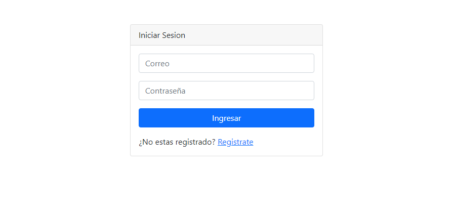
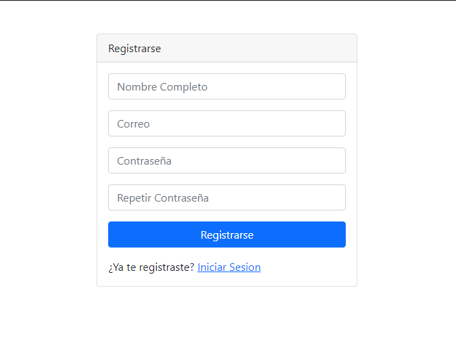
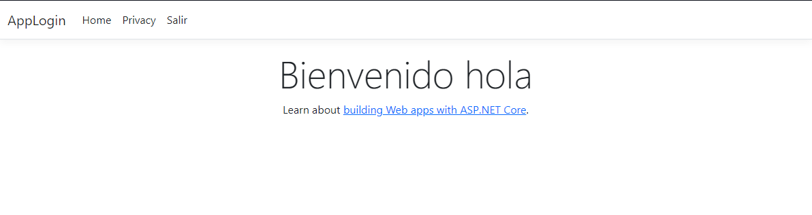

# Login, Registro y Autenticación con ASP.NET CORE 8

## Descripción 📑

Aplicación web desarrollada con ASP.NET Core 8 que permite a los usuarios registrarse e iniciar sesión para acceder a la página principal. Si el usuario no está autenticado, no podrá visualizar otras secciones de la aplicación.

---
## Tabla de Contenidos
- [Características](#características)
- [Tecnologías](#tecnologías-)
- [Paquetes NuGet utilizados](#paquetes-de-nuget-utilizados)

---

## Características

- Registro de nuevos usuarios.
- Inicio de sesión seguro.
- Restricción de acceso a páginas para usuarios autenticados.
- Gestión de sesiones.
- Interfaz moderna y responsiva con Bootstrap.

---

## Tecnologías 🛠

---

## Paquetes de NuGet utilizados

- Microsoft.EntityFrameworkCore.SqlServer
- Microsoft.EntityFrameworkCore.Tools

---
## Vista previa del proyecto
Si quieres hechas un vistazo al proyecto, te recomiendo:
### Pagina de Registro.

### Pagina de Inicio Seción.

### Pagina principal de Bienvenida - Boton Salir.

